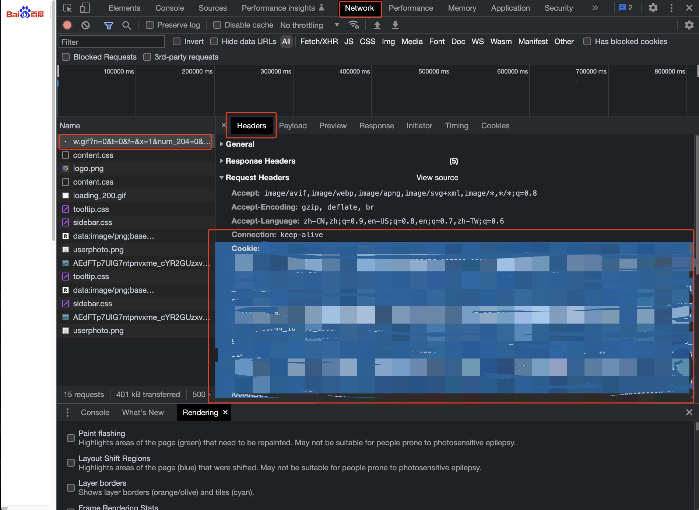

# Auto-GPT Baidu Search Plugin

Language: [English](https://github.com/Significant-Gravitas/Auto-GPT-Plugins/tree/master/src/autogpt_plugins/baidu_search/README.md) | [中文](https://github.com/Significant-Gravitas/Auto-GPT-Plugins/tree/master/src/autogpt_plugins/baidu_search/README.zh.md)

This search plugin integrates Baidu search engines into Auto-GPT, complementing the existing support for Google Search and DuckDuckGo Search provided by the main repository.

## Key Features:
- Baidu Search: Perform search queries using the Baidu search engine.

## How it works
If the environment variables for the search engine (`SEARCH_ENGINE`) and the Baidu cookie (`BAIDU_COOKIE`) are set, the search engine will be set to Baidu.

## Obtaining Baidu Cookie:
1. Open the Chrome browser and search for something on Baidu.
2. Open Developer Tools (press F12 or right-click and select "Inspect").
3. Go to the "Network" tab.
4. Find the first name file in the list of network requests.
5. On the right side, find the "Cookie" header and copy all of its content(it's very long).



Set the `BAIDU_COOKIE` in the `.env` file:

```
SEARCH_ENGINE=baidu
BAIDU_COOKIE=your-baidu-cookie
```

Remember to replace `your-baidu-cookie` with the actual cookie content you obtained from the Chrome Developer Tools.

## Note
In most cases, the AutoGPT bot's queries are automatically set to English. However, if you wish to search in Chinese, you can specify the language in the goals.